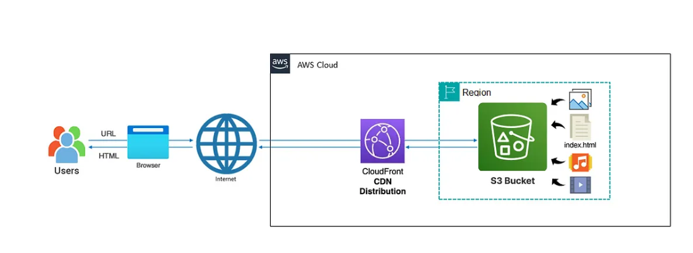

# Hosting a secure Static Website on AWS

This project demonstrates how to host a **Static Website on AWS** using S3, CloudFront, Route 53, and ACM.  
It ensures secure, scalable, and globally distributed hosting with HTTPS support.

---

## Architecture

  

---

## Tools & Services
- **Amazon S3** – Stores static website files (HTML, CSS, JS, images).  
- **Amazon CloudFront** – Content Delivery Network (CDN) for caching and global performance.  
- **AWS Certificate Manager (ACM)** – Provides SSL/TLS certificates for HTTPS.  
- **Amazon Route 53** – Domain Name System (DNS) service to route traffic.  

---

## Features
- Fully managed static website hosting with **Amazon S3**.  
- **Secure HTTPS** using ACM-managed SSL/TLS certificates.  
- **Global performance** optimization with CloudFront caching.  
- **Custom domain integration** via Route 53 DNS.  
- Scalable and cost-efficient hosting solution.  

---

## Deployment Steps (High-Level)
1. **Create S3 Bucket** – Store static website files and enable static hosting.  
2. **Configure Bucket Policy** – Allow public access or restrict via CloudFront.  
3. **Request SSL/TLS Certificate (ACM)** – For domain validation and HTTPS.  
4. **Set up CloudFront Distribution** – Use S3 as origin, attach SSL certificate.  
5. **Configure Route 53 (DNS)** – Point domain to CloudFront distribution.  
6. **Test Website** – Verify domain loads securely over HTTPS.  

---

## Outcome
- A fully functional static website accessible via **HTTPS**.  
- Secure, fast, and globally distributed content delivery.  
- Improved trust for users and better SEO potential. 

---

## Documentation
For the technical step-by-step setup guide, see [SETUP](SETUP.md).  
